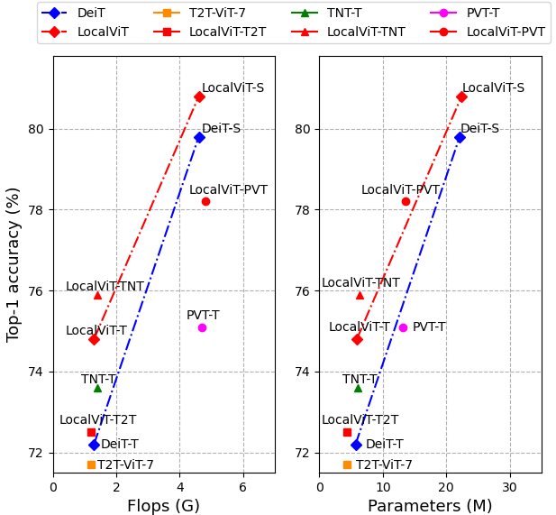

# LocalViT: Bringing Locality to Vision Transformers

This repository contains the PyTorch training and evaluation code for [LocalViT](https://arxiv.org/abs/2104.05707).

LocalViT can consistently improve the performance of current Vision Transformers: 



If you use this code for a paper please cite:

```
@article{li2021localvit,
  title={LocalViT: Bringing Locality to Vision Transformers},
  author={Li, Yawei and Zhang, Kai and Cao, Jiezhang and Timofte, Radu and Van Gool, Luc},
  journal={arXiv preprint arXiv:2104.05707},
  year={2021}
}
```

The repository is based on the [timm package](https://github.com/rwightman/pytorch-image-models) by [Ross Wightman](https://github.com/rwightman) and [Deit](https://github.com/facebookresearch/deit) by Hugo Touvron.


# 1. Model Zoo

The pre-trained models on ImageNet 2012 are provided.

| Model | Top1 acc % | Top 5 acc % | #Params | Download |
| --- | --- | --- | --- | --- |
| LocalViT-T | 74.84 | 92.61 | 5.7M | [model](https://drive.google.com/file/d/1x34YjvhIObfcv1OsVnaKRjuRgPgadm4F/view?usp=sharing) |
| LocalViT-T-SE4 | 75.74 | 93.05 | 9.4M | [model](https://drive.google.com/file/d/1EG8mzoP1qZQxH4XVnYGkLFQT3LcXD-7U/view?usp=sharing) |
| LocalViT-S | 80.78 | 95.38 | 22.4M| [model](https://drive.google.com/file/d/18p7jsRI7sPjBinog81acLdsUicxADJYk/view?usp=sharing) |
| LocalViT-PVT | 78.14 | 94.24 | 13.5M | [model](https://drive.google.com/file/d/1pMcV47s5UchpKVBpe_A8BrtL0pG9yVvF/view?usp=sharing) |
| LocalViT-TNT | 75.90 | 92.90 | 6.3M | [model](https://drive.google.com/file/d/1b6AoHeq7WGFPNB4jibMjWGK1nKfhLvA_/view?usp=sharing) |

SE4 means that the hidden dimension in the SE module is reduced by 4. See Table 2 in the paper.


# 2. Usage

I. Clone the repository locally:
```
git clone https://github.com/ofsoundof/LocalViT.git
```
II. Install [pytorch-image-models 0.3.2](https://github.com/rwightman/pytorch-image-models):

```
pip install timm==0.3.2
```

## Data preparation

Download and extract [ImageNet](http://image-net.org/) train and val images.
The directory structure is the standard layout for the torchvision [`datasets.ImageFolder`](https://pytorch.org/vision/stable/datasets.html#imagefolder) as follows:

```
│imagenet/
├──train/
│  ├── n01440764
│  │   ├── n01440764_18.JPEG
│  │   ├── ......
│  ├── ......
├──val/
│  ├── n01440764
│  │   ├── ILSVRC2012_val_00000293.JPEG
│  │   ├── ......
│  ├── ......
```

# 3. Evaluation

To evaluate [LocalViT-T](https://drive.google.com/file/d/1x34YjvhIObfcv1OsVnaKRjuRgPgadm4F/view?usp=sharing) pre-trained on ImageNet with a single GPU:
```
python main.py --model localvit_tiny_mlp4_act3_r192 --eval --resume /path/to/localvit_t.pth --data-path /path/to/imagenet
```
This should give
```
* Acc@1 74.838 Acc@5 92.610 loss 1.211
```

Evaluating the other models.

--------------------------------------------------------------------

[LocalViT-SE4](https://drive.google.com/file/d/1EG8mzoP1qZQxH4XVnYGkLFQT3LcXD-7U/view?usp=sharing)

```
python main.py --model localvit_tiny_mlp4_act3_r4 --eval --resume /path/to/localvit_t_se4.pth --data-path /path/to/imagenet
```
This should give
```
* Acc@1 75.738 Acc@5 93.048 loss 1.330
```

--------------------------------------------------------------------

[LocalViT-S](https://drive.google.com/file/d/18p7jsRI7sPjBinog81acLdsUicxADJYk/view?usp=sharing)

```
python main.py --model localvit_small --eval --resume /path/to/localvit_s.pth --data-path /path/to/imagenet
```
This should give
```
* Acc@1 80.780 Acc@5 95.376 loss 1.019
```

--------------------------------------------------------------------

[LocalViT-TNT](https://drive.google.com/file/d/1b6AoHeq7WGFPNB4jibMjWGK1nKfhLvA_/view?usp=sharing)

```
python main.py --model localvit_tnt_t_patch16_224 --eval --resume /path/to/localvit_tnt.pth --data-path /path/to/imagenet
```
This should give
```
* Acc@1 75.896 Acc@5 92.898 loss 1.229
```

--------------------------------------------------------------------

[LocalViT-PVT](https://drive.google.com/file/d/1pMcV47s5UchpKVBpe_A8BrtL0pG9yVvF/view?usp=sharing)

```
python main.py --model localvit_pvt_tiny --eval --resume /path/to/localvit_pvt.pth --data-path /path/to/imagenet
```
This should give
```
* Acc@1 78.144 Acc@5 94.238 loss 1.058
```


# 4. Training
Train LocalViT-T on ImageNet on a single node with 8 GPUs for 300 epochs:

```
python -m torch.distributed.launch --nproc_per_node=8 --use_env main.py --model localvit_tiny_mlp4_act3_r192 --batch-size 128 --data-path /path/to/imagenet --output_dir /path/to/save

```

# 5. How to introduce the locality mechanism.

In order to introduce the locality mechanism into existing vision transformers, there are two steps.

I. Replace the MLP layer with [`LocalityFeedForward`](https://github.com/ofsoundof/LocalViT/blob/main/models/localvit.py#L70).

II. Change the computation procedure accordingly.

    1) Split the class token and the image token.
    2) Reshape and update the image token.
    3) Concatenate the class token and the updated image token.
    
The following example show how to introduce locality mechanism into the [orginal Transformer block](https://github.com/rwightman/pytorch-image-models/blob/master/timm/models/vision_transformer.py#L162) by [Ross Wightman](https://github.com/rwightman).

```python
import math
import torch
import torch.nn as nn
from timm.models.layers import DropPath
from timm.models.vision_transformer import Attention
from models.localvit import LocalityFeedForward

class TransformerLayer(nn.Module):
    def __init__(self, dim, num_heads, mlp_ratio=4., qkv_bias=False, qk_scale=None, drop=0., attn_drop=0.,
                 drop_path=0., norm_layer=nn.LayerNorm):
        super().__init__()
        self.norm1 = norm_layer(dim)
        self.attn = Attention(
            dim, num_heads=num_heads, qkv_bias=qkv_bias, qk_scale=qk_scale, attn_drop=attn_drop, proj_drop=drop)
        self.drop_path = DropPath(drop_path) if drop_path > 0. else nn.Identity()
        
        #########################################
        # Original implementation
        # self.norm2 = norm_layer(dim)
        #         mlp_hidden_dim = int(dim * mlp_ratio)
        #         self.mlp = Mlp(in_features=dim, hidden_features=mlp_hidden_dim, act_layer=act_layer, drop=drop)
        #########################################
        
        # Replace the MLP layer by LocalityFeedForward.
        self.conv = LocalityFeedForward(dim, dim, 1, mlp_ratio, act='hs+se', reduction=dim//4)

    def forward(self, x):
        x = x + self.drop_path(self.attn(self.norm1(x)))
        #########################################
        # Original implementation
        # x = x + self.drop_path(self.mlp(self.norm2(x)))
        #########################################
        
        # Change the computation accordingly in three steps.
        batch_size, num_token, embed_dim = x.shape
        patch_size = int(math.sqrt(num_token))
        # 1. Split the class token and the image token.
        cls_token, x = torch.split(x, [1, embed_dim - 1], dim=1)                    
        # 2. Reshape and update the image token.
        x = x.transpose(1, 2).view(batch_size, embed_dim, patch_size, patch_size)  
        x = self.conv(x).flatten(2).transpose(1, 2)                                
        # 3. Concatenate the class token and the newly computed image token.
        x = torch.cat([cls_token, x], dim=1)
        return x
```
